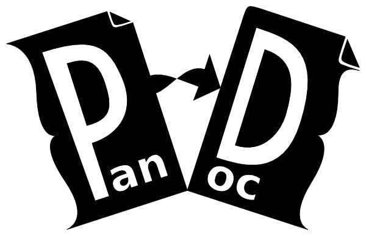

% Programmatic slides
% Pablo Álvarez

# Meaning of programmatic

- You just write plain text into a file
- The file is the input of a program

# What you need

1. A text editor 
	- Or notepad
1. Pandoc 

# Why would you need that

- You may want a slideshow as soon as possible

# It's easy

- Markdown syntax
```md
# Level 1 heading
## Level 2 heading
- Unordered
- list

1. Ordered
2. List


## HTML elements
<br/>
```
# Just one command

```sh
pandoc --self-contained -s --mathjax -i -t revealjs slides.md -o index.html
```

# The end &#127881; &#127881;

[The code for this presentation](https://github.com/5paam/slides-slides)
